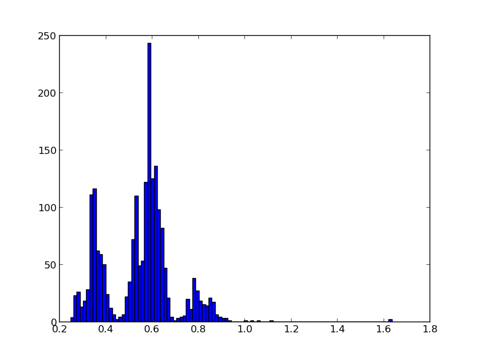
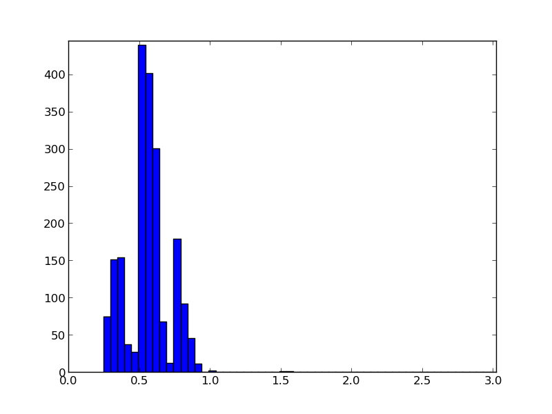
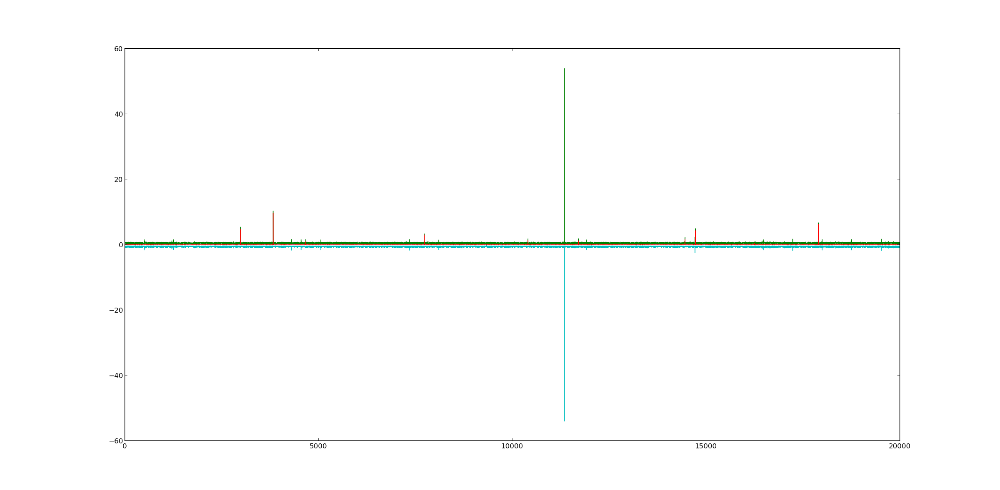

### Parallel Port Trigger for eyelink

We tested the complete delay of sending a parallelport trigger over an eyelink system.
We conntected a parallelport cable from our stimulation pc to the eyelink-host. We set the eyelink-host parallelport to a random integer using: 
```sendCommand("!*write_ioport 0x378 %i"%(randint))```

We tested the *pylink* package from sr-research directly and the pygaze wrapper.
In both cases, for 2000 tested triggers, we observed the majority below 1ms.

### Results


Total time, function call & readout: **Pylink** in [ms]:


Total time, function call & readout: **PyGaze** in [ms]:



In pygaze 2/20.000 (0.0001%) of triggers have a high delay (>10ms, up to 50ms(!)). 8/20.000 are higher than 2ms (0.0004%). Further checks showed, that the extereme delays of ~50ms are during the function call of *tracker.send_command*. 

In all other cases (7 out of 8) it seems that the eyetracker is lagging. We did further testing using matlab and a photodiode, XXX/analysis todo.


Green is the total time, red is the time after the send_command command returned but before the trigger arrived and blue is the negative time of only the send_command. It is clear, that some delays happen after python send the command to the eyetracker (red peaks) but the largest one is clearly the sending of the command.

----
Further tests:
I let the script run for 200.000 triggers because I wanted to see whether the glitch occurs at precicely timed intervals (NTP clock drift update?). It does not seem to do.
Again we have three points in time:
> A
> send_command
> B
> Wait_for_parallel
> C
A-B: The very big lags occur with A-B, i.e. the call of the eyelink library. They can be higher than 50ms, in one case even 1s! In most cases these are smaller 2ms, only in 0.001% cases they are higher.


B-C: Here we observe that sometimes the eyetracker seems to show a delay, 0.0002%. These delays seem to cluster at 14ms and 2ms.

I uploaded the points as a 'b'-pickle [here](./data/200k_triggertest_pylink.pkl)


[The script can be found here](./code/pylink_triggertest.py)
