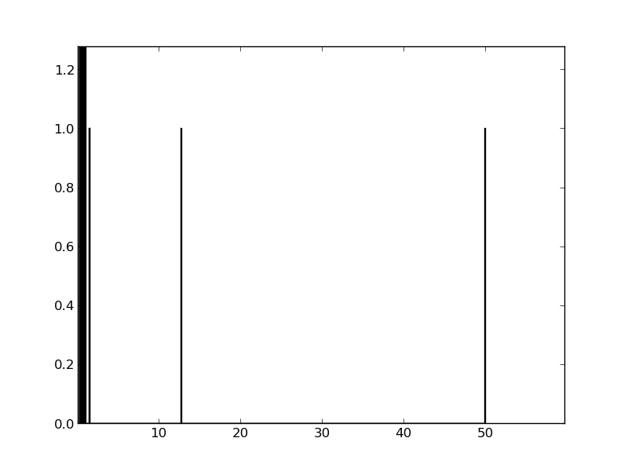

### Parallel Port Trigger for eyelink

We tested the complete delay of sending a parallelport trigger over an eyelink system.
We conntected a parallelport cable from our stimulation pc to the eyelink-host. We set the eyelink-host parallelport to a random integer using: 
```sendCommand("!*write_ioport 0x378 %i"%(randint))```

We tested the *pylink* package from sr-research directly and the pygaze wrapper.
In both cases, for 2000 tested triggers, we observed the majority below 1ms.

### Results


Total time, function call & readout: **Pylink** in [ms]:


Total time, function call & readout: **PyGaze** in [ms]:


In pygaze <0.1% of triggers have a high delay (>10ms, up to 50ms). Further checks showed, that the delay is during the function call of *tracker.send_command*. It is not clear at what point the actual trigger is send. We did further testing using matlab and a photodiode, but could not observe such long delays.


[The script can be found here](./code/pylink_triggertest.py)
