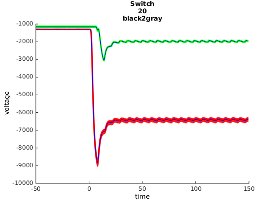
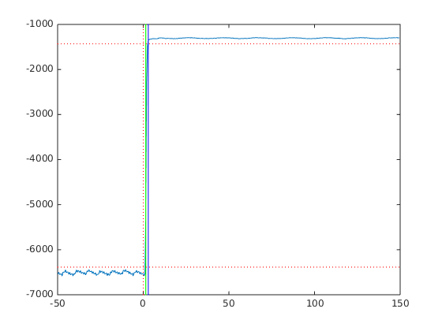
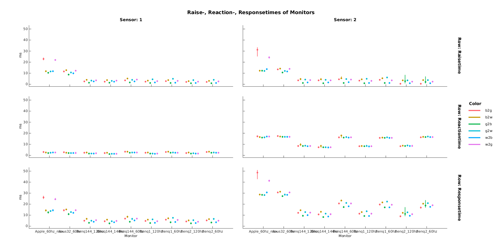

# LCD Monitor Check

## Aim

We tried to find out about the delays of LCD monitors during the presentation of stimuli. Therefore we checked different monitors of different brands on 60Hz, 120Hz and one on 144Hz. We hoped to find a more or less constant delay, so that it's possible to include this data in EEG-experiments. Furthermore we checked how long it will take to send a Trigger and get a response implemented by matlab.

Finally we wanted to have a graph, on which you can see how much delay the used monitor will have.

## Method

First of all we wrote one script for the presentation of stimuli and one for analyzing the data. We measured with two luminance sensors, an ANT 64, presented from Matlab (Ubuntu generic) and recorded with ASA-lab (windows).

#### Sensors
LCD monitors are usually refreshing/updating the screen with 60Hz(so 60 times a second) from top to the buttom. That's why there is always a delay between the upper part of the screen and the lower part. To also check this delay we used to sensors, our sensor 1 is measuring the voltage in the upper left corner, sensor 2 the opposite.

#### Delays
In fact we have three interesting time-differences.
The "raisetime" is the time a monitor needs to change from a color to an other.
The "reactiontime" is the time a monitor needs to react on the input. Thus it is the time between the trigger and the moment in which the monitor begins to change the color.
The "responsetime" consists of the raisetime and the responsetime, so it's the hole delay from the trigger until the color is switched.

#### Measuring
We decided to take black, gray and white as testing-colors. Thus we had six different colorchanges  (with one trigger for each): black-gray, black-white, gray-black, gray-white, white-black and white-gray. For each switch we had 400 trials. It was also important to measure the monitors on the highest brightness, because otherwise the backlight starts to fluctuate which causes much bigger delays. In addition to the standard-flipping-presentation (with 150ms + random between the colors) we measured the "as-fast-as-possible-flipping".

Unfortunately our Sensors were recognizing different voltages during presenting the same color and also the individual sensor was not constantly recognizing voltage, although it was the same color. Luckily this bug is not influencing the data we are interested in, because it doesn't matter which level of voltage it reaches, it's just important how much time it takes. Thus this brought no interpretation problems.

##### Monitors
       | 60Hz | 120Hz | 144Hz
-------|--------|-----|-------
Apple   |X |-|-
Asus32  |X |-|-
Benq1   |X |X|-
Benq2   |X |X|-
Benq144 |X|X|X

## Analysis
In the analysis-script we began to epoch the data and used the time interval before and after the trigger to calculate the mean voltage of the "target color" and the "current/origin color". Sensor 1 is shown in red, sensor 2 in green. Trigger came at 0.

       

On the basis of this means, the thresholds were generated. One threshold represents the moment, where the color starts to change and the second one represents the moment, where the target color is reached.

Actually we tried to normalize the data from the two sensors but because of some weird outcomes we rechecked the sensors, recognizing that they are not constantly working (however still not problematic).

## Final Graph

The following Graph shows six subplots separated into three plots for each sensor. Then its also separated into three rows: raisetime, reactiontime and responsetime at the buttom. The different colors are representing the switches as you can see on the right. In fact you can see for every monitor-condition how big the raise, reaction or response time is for a certain switch. Pay heed to the sensors! Again, sensor 1 is located at the upper left corner of the screen and sensor 2 at the right buttom. That is important for the interpretation of the differences in the feature reactiontime.

## Trigger-Check

On three computers we checked the parallel ports and the time they need until a response. This procedure was just to make sure that there are no significant delays of the trigger itself which manipulates the data of the monitors.

       | Mudddy | Ren | Stimpy
-------|--------|-----|-------
Mean   |0.134ms |0.058ms|0.056ms
       |0.102ms |0.066ms|0.054ms
       |0.105ms |   -   |0.061ms
Max    |3.168ms | 0.080ms| 0.129ms
       |0.202.ms|0.137ms|0.125ms
       |0.234ms |   -   |0.804ms (10000 trials)
