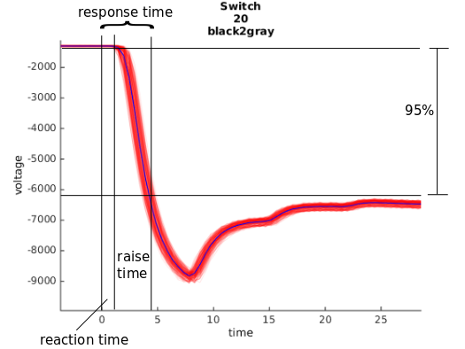

# LCD Monitor Check

## Introduction

Even modern LCD monitors have an input lag (response time). In psychophyscial Experiments (especially EEG) it is important to ensure proper timing, thus we measured the total response time of various LCD monitors in our lab. We measured different Brands at different Refresh Rates up to 144Hz. In summary we find short delays for the Monitors BenQ XL2420T and BenQ XL2430T.

## Definitions
There are three time-differences of interest.
The *raise time* is the time the LCD-crystals needs to change from one luminance to another.
The *reaction time* is the time between the computer-command to show an image and the moment in which the monitor begins to change the luminance.
The *response time* is the sum of the raise time and the response time, thus the full input lag.

       

This example here shows both sensors, one on the upper left, the other on the lower right corner. Notice the delay in *reaction time* that represents the vertical retrace of the monitor
       

## Results

### Latencies

Columns show the two sensors. Rows show *raise time*, *reaction time* and the summed *response time*. The different colors represent the switches between colors. Pay heed that the most conservative input measurement is represented by *sensor 2* (lower corner) in the *response time* column. I.e. for our fastest monitor we still have an input delay from flip-command at the computer to actual target luminance reached of ~11.2ms.

### Trigger-Check

On three (identically configured!) display computers we measured the delay of sending a trigger via the parallel port. We did this by setting a signal on one pin, having a hardware bridge to another pin and measuring the time until the voltage on the other pin was changed. We repeated this 200 times and noted the mean and maximal value.
Note that under some non-replicable settings we found a single trigger with 3ms delay!

       | Mudddy | Ren | Stimpy
-------|--------|-----|-------
Mean   |0.134ms |0.058ms|0.056ms
       |0.102ms |0.066ms|0.054ms
       |0.105ms |   -   |0.061ms
Max    |3.168ms | 0.080ms| 0.129ms
       |0.202.ms|0.137ms|0.125ms
       |0.234ms |   -   |0.804ms (10000 trials)

## Methods

Our presentation script can be found [here](./code/trigger_test_rdy.m). We measured with two custom-made luminance sensors and a TMSI Refa-8 amplifier at 2048Hz. Stimuli were presented using [PsychoToolbox](http://psychtoolbox.org/) under Ubuntu 14.

#### Sensors
LCD monitors are usually refreshing the screen from top to the bottom. That's why there is a delay between the updating of the upper part of the screen and the lower part. To precisely quantify this delay we used two sensors, *Sensor 1* on the upper left corner, and *Sensor 2* on the lower right corner.
Due to our sensor design, we have different dynamic ranges for each sensor and also each montage on the displays. Importantly, this does not influence the features we are interested in, as this represents only a linear scaling of the voltage but the time properties are still the same.

Note: Depending on the back light technique, it is important to measure the monitors on the highest monitor brightness due to PWM, a technique that modulates the brigthness of the back light with a certain frequency (in our monitors ~185Hz). 

## Analysis
For the analysis we epoched the data to the trigger. To detect the raisetime used 50ms before and 50ms - 100ms after the trigger to calculate the mean voltage of the "target color" and the "current/origin color". The difference between these two is the *raise time*. The first time is the *reaction time* and the second time the *response time*.

#### Presentation 
The LCD-crystals change their color with different speeds, depending on the current and future target color. Therefore, we used three colors: Black, White and Gray and pairwise switches (6 in total). We showed full-display stimuli for 150ms + uniform jitter of up to 25ms. A trigger marking the flip of the graphics card was send using a parallel port.
After 400 trials for each switch, we additionally measured display luminances when changing from white to black and back at every frame.
We used the synchronous setting from psychotoolbox, that means, the command waits for the flip-onset of the graphics card and is thereby synchronous to the vertical retrace of the monitor ([more details here](http://docs.psychtoolbox.org/Flip)).

##### Monitors
       | 60Hz | 120Hz | 144Hz
-------|--------|-----|-------
Apple   |X |-|-
Asus32  |X |-|-
Benq1   |X |X|-
Benq2   |X |X|-
Benq144 |X|X|X
